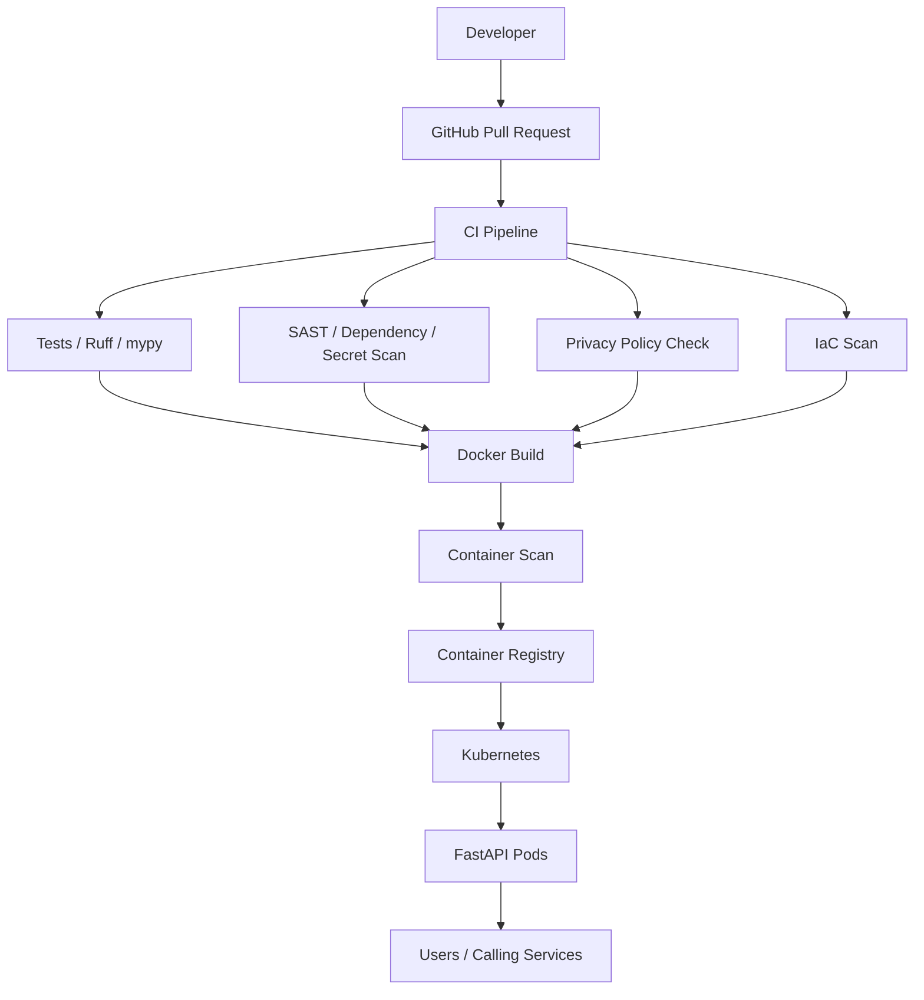

# Architecture



## Runtime layering

```text
Kubernetes
   -> Pod
      -> Container image
         -> Ubuntu userspace
            -> Python
               -> FastAPI
```

Modern Kubernetes normally uses a CRI runtime such as containerd; Docker is still
commonly used to build/test OCI container images.
